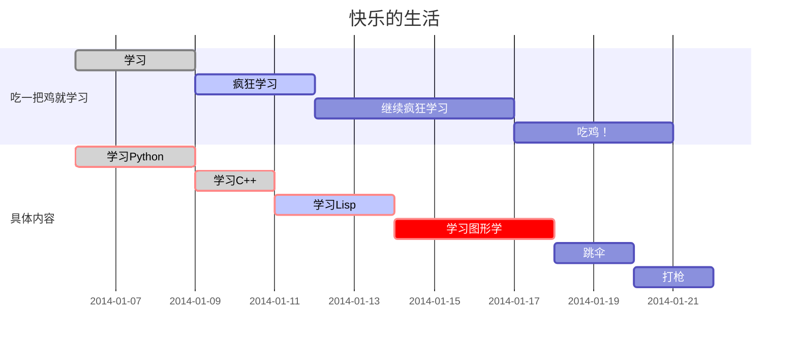

# Markdown-Practice

markdown语言是一种轻量级标记语言；它允许人们使用易读易写的纯文本格式编写文档，markdown编写的文档可以导出html、word、图像、pdf、epub等多种格式的文档；其编写的文档后缀为.md，.markdown；当前许多网站都广泛使用markdown来撰写帮助文档或是用于论坛上发表消息，例如：Github、简书、reddit等；很有编辑器都支持markdown语言，本项目主要使用 [Typora](https://typora.io/) 编辑器来编写文档，其支持 MacOS、Windows、Linux等平台，且包含多种主题，并且编辑后直接渲染出效果，也就是所谓的所见即所得；相关的markdown语言的书籍有《了不起的Markdown》；这里有两个基本的Markdown语法教程链接 [链接1](https://www.jianshu.com/p/191d1e21f7ed)，[链接2](https://guo365.github.io/study/Markdown.html)


## 0. 目录

#### 	[1. 标题](#标题)

#### 	[2. 字体](#字体)

#### 	[3. 引用](#引用)

#### 	[4. 分割线](#分割线)

#### 	[5. 图片](#图片)

#### 	[6. 超链接](#超链接)

#### 	[7. 列表](#列表)

#### 	[8. 表格](#表格)

#### 	[9. 代码](#代码)

#### 	[10. 流程图](#流程图)

#### 	[11. 页内跳转](#页内跳转)

******************
******************


## <span id="标题">1. 标题</span>

在想要设置为标题的文字前面加 ```#```来表示

一个```#```是一级标题，两个```#```是二级标题，以此类推，一共支持六级标题

```
# 这是一级标题
## 这是二级标题
### 这是三级标题
#### 这是四级标题
##### 这是五级标题
###### 这是六级标题
```

效果如下

# 这是一级标题

## 这是二级标题

### 这是三级标题

#### 这是四级标题

##### 这是五级标题

###### 这是六级标题


## <span id="字体">2. 字体</span>

+ ### 加粗

要加粗的文字左右分别用两个```*```号包起来

+ ### 斜体

要倾斜的文字左右分别用一个```*```号包起来

+ ### 斜体加粗

要倾斜和加粗的文字左右分别用三个```*```号包起来

+ ### 删除线

要加删除线的文字左右分别用两个```~```包起来

```
**这是要加粗的文字**
*这是要倾斜的文字*
***这是要斜体加粗的文字***
~~这是要加删除线的文字~~
```

效果如下

**这是要加粗的文字**

*这是要倾斜的文字*

***这是要斜体加粗的文字***

~~这是要加删除线的文字~~


## <span id="引用">3. 引用</span>

在引用的文字前加```>```即可，引用可以嵌套，如加两个或者三个```>```

```
> 这是引用的内容
>> 这是引用的内容
>>> 这是引用的内容
```

效果如下

> 这是引用的内容
> > 这是引用的内容
> >
> > > 这是引用的内容


## <span id="分割线">4. 分割线</span>

三个或者三个以上的```-```或者```*```都可以构成分割线

```
**************
--------------
--------------
**************
```

效果如下

**************
--------------
--------------
**************


## <span id="图片">5. 图片</span>

在Markdown语法中支持图片的加入

```

```

图片alt就是显示在图片下面的文字，相当于对于内容的解释

图片地址可以是.md文件所在项目相对地址，可以是绝对地址，可以是网址

图片title就是图片的标题，当鼠标移到图片的时候，会显示title的内容，可加可不加

```

```

***注意***，所有的符号都是英文符号

（***注意***，这里关于图片的插入有点问题，可能是typora的问题，图片无法上传；也可能是github的问题，使用这种方法github图片总是不显示；所以这张图片是直接拖到github上的，具体怎么解决后续研究）


## <span id="超链接">6. 超链接</span>

超链接是在本页面内的外部链接，通过点击这些超链接可以跳转到相应页面中去，其语法是：

```
[超链接名](超链接地址 "超链接title")
title可加可不加
```

例如：

```
[我的Github主页](https://github.com/polaris-chn)
```

其显示结果就是

[我的Github主页](https://github.com/polaris-chn)

这种超链接在点击之后会在原窗口打开新的超链接窗口，Markdown本身语法不支持链接在新页面打开，有的平台，例如简书，可以使用html语言的a标签来代替，如下所示

```
<a href="https://github.com/polaris-chn" target="_blank">我的Github主页</a>
```

其显示结果就是

<a href="https://github.com/polaris-chn" target="_blank">我的Github主页</a>

但是在Github平台好像还是不行，所以可以采用另一种方式，在点击超链接的时候，按住```ctrl```键，就可以在新页面打开超链接


## <span id="列表">7. 列表</span>

### 无序列表

无序列表可以使用```-```，```+```，```*```任意一种

```
- 列表内容
+ 列表内容
* 列表内容
```

***注意***：```-```，```+```，```*```和内容之间都要有一个空格

效果如下：

- 列表内容
+ 列表内容

* 列表内容

### 有序列表

有序列表直接使用数字加点即可

```
1. 列表内容
2. 列表内容
3. 列表内容
```

***注意***：点和内容之间都要有一个空格

效果如下

1. 列表内容
2. 列表内容
3. 列表内容

### 列表嵌套

上级列表完成后回车会产生一个和上级列表同一层次的列表，这是删除这个列表符号，在点```-```，```+```，```*```或者数字，敲一个空格（backspace或者回车）就会产生下级列表

* 一级无序列表
  * 二级列表
    * 三级列表
      1. 四级列表

但是这里上传到Github好像还有点问题，这里的```1```变成了```a```，以后再解决吧。

### 任务列表

Markdown可以生成很实用的任务列表，要创建任务列表，前缀列表项`[ ]`，其语法如下（不需要写在代码框，直接写即可）：

```
- [ ] 任务1
- [x] 任务2
```

***注意***：`-`和`[ ]`之间有空格，`[ ]`内部有空格，`[ ]`和`任务`之间有空格，少任意一个空格都不行；如果表示任务完成，`[ ]`之间加一个字母`x`即可。例如：

```
  - [ ] 跑步
  - [ ] 骑车
  - [x] 吃饭
  - [ ] 睡觉
```

- [ ] 跑步
- [ ] 骑车

- [x] 吃饭

- [ ] 睡觉

列表这里只是一个简单的使用教程，更多高级的教程有待后续学习。


## <span id="表格">8. 表格</span>

可以使用Markdown语言写一些简单的表格，其语法如下：

```
表头|表头|表头
---|:---:|---:
内容|内容|内容
内容|内容|内容
```

第二行分割表头和内容；

```-```有一个就可以了，多写几个是为了对齐；

文字默认居左；

```-```两边加```:```表示文字居中；

```-```右边加```:```表示文字居右；

并且原生的语法两边都要使用```|```包起来，此处就可以不用了。

例如：

```
姓名|技能|排行
---|:---:|---:
刘备|哭|大哥
关羽|打|二哥
张飞|骂|三弟
```

其结果如下：

| 姓名 | 技能 | 排行 |
| ---- | :--: | ---: |
| 刘备 |  哭  | 大哥 |
| 关羽 |  打  | 二哥 |
| 张飞 |  骂  | 三弟 |


## <span id="代码">9. 代码</span>

Markdown中可以插入代码或者任何自己想要凸显的内容

#### 文本行中插入代码

需要在代码左右都使用一个反引号，即

```
`代码内容`
```

例如：

```
你好，世界！`hello world!`
```

其结果如下：

你好，世界！`hello world!`

### 单独插入代码

单独引用一块代码，回车另起一行之后使用三个反引号就会出现可以写代码的地方，就可以在这里写代码，即

```
​```
hello world!
​```
```

***注意***：标准的情况下，代码块前后都需要有三个反引号，但是typora只要回车使用三个反引号就会出现写代码的地方。

其结果显示如下

```
hello world!
```


## <span id="流程图">10. 流程图</span>

Markdown语言可以画出流程图，typora支持三类流程图，分别是：

* sequence
* flowchart
* gantt

但是需要在代码块右下角出现的`选择语言`选择相应的语言，例如下面的代码块可以生成简单的SVG流程图，不过需要在`选择语言`栏中输入`flow`：

```
st=>start: 开始
op=>operation: My Operation
cond=>condition: Yes or No?
e=>end
st->op->cond
cond(yes)->e
cond(no)->op
```

```flow
st=>start: 闹钟响起
op=>operation: 与床板分离
cond=>condition: 分离成功?
e=>end: 快乐的一天

st->op->cond
cond(yes)->e
cond(no)->op
```

对于`sequence`图，可以输入如下代码块，在`选择语言`中输入`sequence`：

```
李雷 -> 韩梅梅: Hello 梅梅, How are you?
Note right of 韩梅梅: 韩梅梅心想
韩梅梅 --> 李雷: I'm fine, thanks, and you?
```

其结果显示如下：

```sequence
李雷 -> 韩梅梅: Hello 梅梅, How are you?
Note right of 韩梅梅: 韩梅梅心想
韩梅梅 --> 李雷: I'm fine, thanks, and you?
```

对于`gantt`图，代码块中插入如下代码，在`选择语言`中输入`mermaid`就会渲染成`gantt`图，其中首行的`gantt`不可少：

```
gantt
    dateFormat  YYYY-MM-DD
    title 快乐的生活
    section 吃一把鸡就学习
    学习            :done,    des1, 2014-01-06,2014-01-09
    疯狂学习               :active,  des2, 2014-01-09, 3d
    继续疯狂学习               :         des3, after des2, 5d
    吃鸡！               :         des4, after des3, 4d
    section 具体内容
    学习Python :crit, done, 2014-01-06,72h
    学习C++          :crit, done, after des1, 2d
    学习Lisp             :crit, active, 3d
    学习图形学        :crit, 4d
    跳伞           :2d
    打枪                      :2d
```

其结果显示如下：



关于流程图还有很多可以学习的，这只是一个简单的示例而已（但是这里上传到Github上好像显示不出图，后续再解决这个问题吧）。


## <span id="页内">11. 页内跳转</span>

页内跳转，也称为锚点或者页内超链接，实现在当前页面的跳转，Markdown有自己的锚点的语法，但是这里介绍的是基于html语言的跳转方法，其语法形式如下：

```
[跳转点名字](#跳转点id)
<span id="跳转点id">跳转点名字</span>
```

***注意***：这里的`跳转点id`可以是任意字符，只要两个相同即可；这里的两个`跳转点名字`可以不同

例如：

```
[跳转](#跳转点)
<span id="跳转点">跳转到这里</span>
```

其结果如下

[跳转](#跳转点)


<span id="跳转点">跳转到这里</span>

这个`README.md`目录和各个标题之间的跳转都是采用这样的形式，可以看这个文件的源码进行进一步的理解学习。


